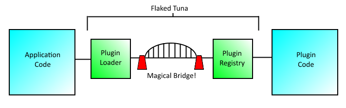

# Flaked Tuna    #

A lightweight, cross-platform C++17 Plugin Framework.

[LC]: https://github.com/flagarde/FlakedTuna/actions/workflows/Linux-Clang.yml
[LCB]: https://github.com/flagarde/FlakedTuna/actions/workflows/Linux-Clang.yml/badge.svg

[LG]: https://github.com/flagarde/FlakedTuna/actions/workflows/Linux-GCC.yml
[LGB]: https://github.com/flagarde/FlakedTuna/actions/workflows/Linux-GCC.yml/badge.svg

[MC]: https://github.com/flagarde/FlakedTuna/actions/workflows/MacOS-Clang.yml
[MCB]: https://github.com/flagarde/FlakedTuna/actions/workflows/MacOS-Clang.yml/badge.svg

[MG]: https://github.com/flagarde/FlakedTuna/actions/workflows/MacOS-GCC.yml
[MGB]: https://github.com/flagarde/FlakedTuna/actions/workflows/MacOS-GCC.yml/badge.svg

[MS]: https://github.com/flagarde/FlakedTuna/actions/workflows/Windows-MSYS2.yml
[MSB]: https://github.com/flagarde/FlakedTuna/actions/workflows/Windows-MSYS2.yml/badge.svg

[MM]: https://github.com/flagarde/FlakedTuna/actions/workflows/Windows-MSVC.yml
[MMB]: https://github.com/flagarde/FlakedTuna/actions/workflows/Windows-MSVC.yml/badge.svg

## Builds
|        | Linux Clang | Linux GCC | MacOS Clang | MacOS GCC | Windows M2sys | Windows MSVC |
|--------|-------------|-----------|-------------|-----------|---------------|--------------|
| Github |[![Linux Clang][LCB]][LC]|[![Linux GCC][LGB]][LG]|[![MacOS Clang][MCB]][MC]|[![MacOS GCC][MGB]][MG]|[![Windows MSYS2][MSB]][MS]|[![Windows MSVC][MMB]][MM]|

## Where does one get Flaked Tuna? ##
Flaked Tuna is free and open source software distributed under the MIT software license.  Currently it is located on GitHub and presumably you already know the link if you are reading this document.  If not, you can download it at: github.com/ralck/flakedTuna

## What is Flaked Tuna ? ##
Simply put, it is a plugin framework for C++ designed to be light-weight, portable, and allow for easy dynamic loading.  It is comprised of two halves that take care of bridging between the plugin code and application code.  It uses the idea of Inversion of Control (IoC) to make the magic happen.

## A few quick details before we go on : ##
Flaked Tuna is designed around the C++11 standard and thus needs compiler support.  It is also designed as a static library for easy of maintainability.

## How does it work ? ##
On each side of the framework is an IoC container specifically tasked with one part of the plugin loading.  The plugin side is where the Plugin Registry lives.  This part of the framework makes it easy for a developer to register a plugin object without having to know the details.  Similarly, on the application side lives the Plugin Loader.  Its task is to find all plugin objects registered in plugin modules and pull them into the application side.



Okay, so it is not really a magical bridge in between.  In reality, it is C style exports baked into a couple easy macros to allow the developer to focus on the plugin and application code rather than loading the plugins.

## How does one use it? ##
Aha, here is the part of this guide you have been waiting for!  Usage is broken down into a couple easy steps:
 1.	Build the library.  This is pretty simple; add the source files to your favorite IDE or make file system. If you are on Windows, make sure you have the WIN32 preprocessor flag defined.  Build it into a static library (.lib on Windows or usually .a on Linux).
 2.	Include the necessary header files in your plugin code.  As far as Flaked Tuna, all you need is PluginRegistry.h.  Typically, you also need to include your plugin's base class, depending on how you have set up your plugin, but I will leave that implementation up to you.
 3.	Set up the plugin macros to register your plugin.  These are:
	FLAKED_TUNA_EXPORTS_BEGIN			// Begins the plugin registration
	FLAKED_TUNA_PLUGIN( concrete, base )	// Registers each plugin per base type
	FLAKED_TUNA_EXPORTS_END			// Ends the plugin registration
   There is also an optional macro for setting up the plugin version.
	FLAKED_TUNA_PLUGIN_VERSION( version )
 4.	Set your compiler to compile the plugin as a shared library.  On Windows this is a .dll; on Linux it is usually a .so.
Note: The default extension (.dll or .so) is not required for the Flaked Tuna framework, so use what ever tickles your fancy!
 5.	Include the necessary header files in your application code.  For Flaked Tuna, this is just PluginLoader.h.  Again, I will leave the other implementation details up to you.
 6.	Set up your linker so that your application code links to FlakedTuna.lib (built in Step 1).
 7.	In your application code, create an instance of a PluginLoader object, add search directories, and load in plugins.

 ```cpp
	FlakedTuna::PluginLoader loader;
	loader.FindPluginsAtDirectory("Path\\To\\Plugin", "dll"); // Windows
	loader.FindPluginsAtDirectory("Path/To/Plugin", "so");    // Linux
	std::vector<std::shared_ptr<IPlugin>> plugins = loader.BuildAndResolvePlugin<IPlugin>();
 ```
 8.	Build your plugin and your application.  That is it!  You are now using the Flaked Tuna plugin framework. ☺

There is also some example code already set up (with Visual Studio solution/project files) that you can examine or try out the pre-compiled versions.  You can find this in the example directory on github.  The example has been updated to compile on Linux, but no make file is included yet.

## Important Notes : ##
First and foremost, the PluginLoader must remain in memory while your plugins are active.  As shown above, it creates the bridge to your plugin code.  If it is garbage collected while you are still using your plugins, the bridge collapses, all boat traffic is stuck in the harbor, and bad things may happen (i.e. segfault).  TL;DR: Don't delete or let the system garbage collect your PluginLoader while you are using your plugins.

Secondly, a sometimes overlooked feature of C++ is object instantiation and destruction.  Objects are created in the order they are listed and destructed in the reverse order.  Order of members is important.  The PluginLoader should not be destructed before the objects holding your plugins are.  TL;DR: Put the PluginLoader ahead of your plugin objects so it is destructed last.
